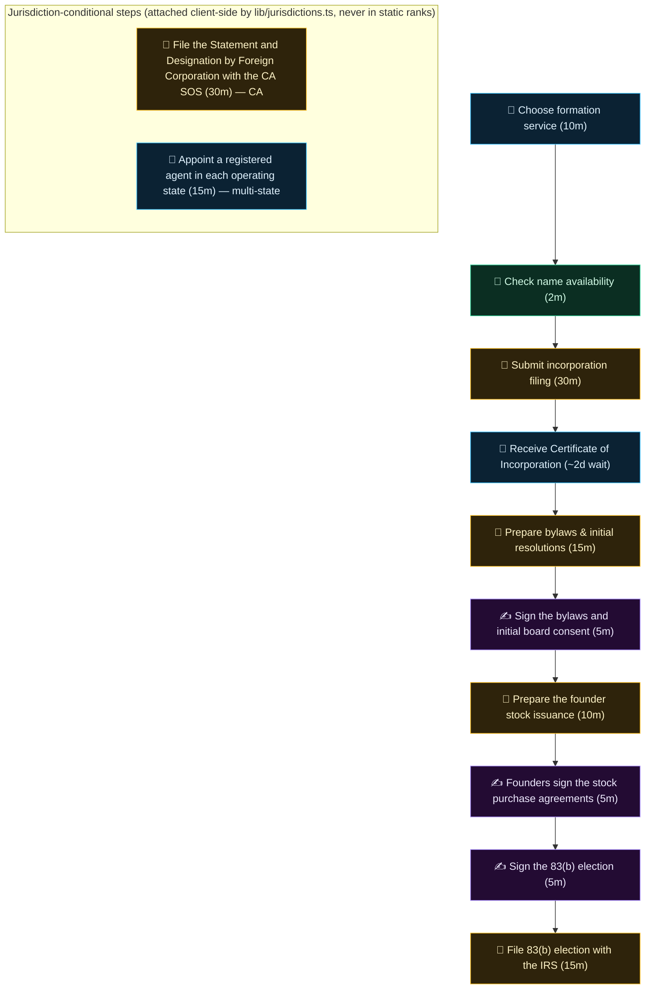

# Processes — human guides and machine-readable workflows

Two layers, deliberately separate:

1. **Jurisdiction-scoped workflows** (this tree, `processes/<domain>/<jurisdiction>/*.json`,
   contract in `schemas/process.schema.json`): source-cited legal/tax workflows with explicit
   applicability dimensions, dated editorial review, rule-card references, stop conditions, and
   a scoped human approval on every externally-effectful step. Validated by
   `lib/founderOps.ts` inside the normal test gates. The starter set is two demonstration US
   Delaware equity workflows (409A valuation review, 83(b) election) — status `demonstration`,
   not production-certified; see `governance/REVIEW_POLICY.md` for the maturity ladder.

2. **The operational corpus** (`corpus.json` in this directory, 146 records rendered live at
   [ultrametric.ai/processes](https://ultrametric.ai/processes) — each process at
   `/processes/<id>` — contract in `schemas/operational-process.schema.json`):
   step-by-step operating DAGs with agent/manual/human routing, judged vendor rankings per
   step, the Agentic % of each process, and time estimates. These are operating guides, not legal advice, and
   they carry no jurisdiction warranty — the site's jurisdiction toggle (`lib/jurisdictions.ts`)
   and geo scoping annotate where steps are US- or state-specific.

   Since 2026-10-01 the corpus carries two kinds of record: 124 **processes** (the proactive
   founder timeline) and 12 **situations** (`kind: "situation"` — reactive, trigger-driven:
   a cease-and-desist arrives, a visa is stuck, a breach is live). A situation is the same
   machinery — DAG, routing, ceilings, vendors, reversibility, geo — plus a one-sentence
   `trigger` and an honest `urgency` clock (`hours`/`days`/`weeks`), and deliberately NO
   `timeOrder` slot: reactive work is not a stop on the founder timeline, so /processes groups
   situations under their own area and sorts them after the timeline. Where a situation leans
   on a legal deadline, its description cites a dated rule card in `rules/` (the
   `lib/openstartup/deadlines.ts` needs-review doctrine) and its steps link the primary source.

A process here may cite operational corpus pages for the how-to mechanics; the operational
corpus links back when a step crosses into fact-specific legal territory. The two layers keep
separate IDs and never silently substitute for each other. Stage 2 of the corpus lift
(2026-09-28) moved the operational corpus here from `data/processes.json`, byte-identical —
paths only: `lib/processes.ts` `loadProcesses()` reads `processes/corpus.json`, and the
founder-ops workflow validator (`lib/founderOps.ts`) deliberately skips `corpus.json` when it
walks this tree (the corpus has its own schema and gates). The two layers now live side by
side under this directory as promised.

## What a corpus record is

One record per founder process: identity and classification (`phase`, `cadence`,
`complexity`), an honest Agentic % (`supportLevel` + `supportReason`), the vendors that can
run it, the step DAG, and geo scoping. A trimmed real record (`form_002`, Get EIN):

```jsonc
{
  "id": "form_002",
  "title": "Get EIN",
  "phase": "formation",
  "cadence": "once",
  "complexity": "simple",
  "supportLevel": "manual_guide",
  "supportReason": "IRS EIN application is a web form with no API. System provides step-by-step guidance and pre-fills company data.",
  "vendors": ["irs", "stripe_atlas", "firstbase", "legalzoom"],
  "dag": {
    "nodes": [
      { "id": "n2", "label": "Pre-fill EIN application data", "route": "agent", "estimatedMinutes": 1 },
      { "id": "n3", "label": "Complete IRS SS-4 form online", "route": "form", "estimatedMinutes": 10 },
      { "id": "n4", "label": "Store EIN in company records", "route": "agent", "estimatedMinutes": 1 }
    ],
    "edges": [{ "from": "n2", "to": "n3" }, { "from": "n3", "to": "n4" }]
  },
  "geoScope": "us",
  "geoNotes": [{ "country": "IN", "kind": "absorbed", "summary": "PAN and TAN … are allotted automatically as part of the SPICe+ incorporation filing…", "actionUrl": "https://www.incometax.gov.in/iec/foportal/" } /* …UK/DE/FR analogs trimmed */]
  // …contextNeeded, tags, time totals, annoyance/risk/growthImpact trimmed
}
```

Every step carries a route: `agent` (an agent can run it), `form` (a manual web form — no
API), `person` (human judgment or computer use), and `person` steps can additionally be marked
`legalSignature` — the true human floor, a legally required signature/attestation.

## Reversibility

Every process AND every step carries a required `reversibility` tier (founder ask 2026-09-30:
map what is irreversible, reversible, and "irreversible with pain"). The judgment test is
**"what does undoing actually take"** — never how risky or annoying the work is (that's `risk`
/ `annoyance`):

- **`reversible`** — freely undoable: drafts, configs, most SaaS setup, waits on third
  parties, internal governance paper a later consent supersedes. A routine external send whose
  correction costs nothing (a follow-up email) is reversible in practice.
- **`painful`** — irreversible with pain: undoable at real cost. Incorporating in the wrong
  state (re-domestication), entity conversion, switching payroll providers mid-year, migrating
  banks, breaking a lease, renaming the company, walking back a public announcement, unwinding
  an executed contract, withdrawing a government registration.
- **`irreversible`** — cannot be undone: dissolution filed, an 83(b) election filed (the
  missed window never reopens), equity issued and accepted, a wire sent, a refund processed,
  an employee terminated.

Curation rules: classify the **step's own act** — a "Receive the certificate" step commits
nothing (reversible) even though the filing before it did; a "Sign the X" step is reversible
while the paper is unfiled and unaccepted (the signed-but-unfiled 83(b)), and binding once
executed and accepted. The two levels are curated independently: a *painful* process can
contain one truly *irreversible* filing step (Incorporate C-Corp — the entity can be
dissolved, the filed 83(b) cannot be unfiled), and an *irreversible* process is mostly
reversible steps until the wire goes out. Irreversible is deliberately rare at both levels —
totality and distribution are pinned by `lib/__tests__/reversibility.test.ts`. No zod default
exists: an unclassified process or step fails the corpus parse.

## Verification checks (`verify`)

Every step should answer **"how do I know it worked?"** — steps that have a concrete, externally
checkable test carry an optional `verify: { how, url? }` (depth wave pt 1, 2026-10-01):

- **What qualifies**: a check a founder can actually run against an external source of truth —
  the Delaware entity search showing the new entity, TSDR showing the trademark serial number,
  EDGAR full-text search showing the accepted Form D, an RDAP/WHOIS lookup showing the domain,
  the CP 575 notice for an EIN, pay stubs plus the provider's tax-deposit confirmation for a
  payroll run. Artifacts to *retain* (a date-stamped 83(b) copy, a certified-mail receipt, an
  executed Form 1583) qualify: the retained artifact IS the check.
- **What does not**: a restatement of the step ("account created" for a create-account step),
  internal drafting or decisions, anything with no external source of truth. A `verify` that
  restates the step is worse than absence — those steps simply carry no field.
- **URLs**: https only, primary sources preferred (government portals, registrar tools), and
  every URL is verified live before it ships — same bar as `actionUrl`. Steps whose check has
  no canonical tool carry `how` alone.

## Cost honesty (`cost`)

Steps with a real, KNOWABLE cost carry an optional
`cost: { usd, kind, source, asOf, note? }`. The rules:

- **Every number carries a source URL and an asOf date.** Fees change — the `asOf` date (when
  the number was read off the cited page) is the contract; currentness is never claimed.
- **Kinds**: `government-fee` (published fee schedules: Delaware filing fees and franchise-tax
  minimums, USPTO trademark fees, state filing fees), `free` (`usd: 0` where the authority says
  so — the IRS issues EINs for free, the SEC charges nothing for a Form D), and
  `typical-vendor-price` ONLY where a published sticker price exists (Stripe Atlas's $500,
  Apple's $99/yr — the pricing page is the source).
- **Never estimate.** A real cost with no published number ships as `usd: null` with the source
  explaining the variability ("attorney fees vary") — nothing is averaged or guessed. Anything
  that cannot be sourced does not ship at all.
- **`note`** carries the required caveat: minimums that scale (DE incorporation varies with
  authorized stock), per-class fees (USPTO), what a vendor price bundles.
- **Derived, never hand-stored**: the process-page "Known government fees: $X" headline is
  `knownCostUsd()` in `lib/processes.ts` — the sum of the dated per-step `government-fee`
  numbers ONLY. Vendor prices are excluded from the headline so it never implies a completeness
  the curation doesn't claim.

## Failure modes (`failureModes`) — spike-introduced

Introduced by the founder spike (2026-10-02) that took `form_001` to reference depth: steps
where something concretely goes wrong may carry
`failureModes: [{ what, then, source? }]` — what the failure is, and what the honest recovery
is. Curation rules, stricter than coverage:

- **Only sourced or structurally certain entries.** A Delaware name conflict (the §102(a)(1)
  distinguishability standard), a defective-certificate rejection (§103 — nothing exists until
  the 'Filed' endorsement), a lost stamped certificate (the published certified-copy fee), the
  missed 83(b) window (jurisdictional, no cure). Never speculation, never a generic "be
  careful".
- **`then` is the honest recovery** — including the honest *absence* of one: the missed 83(b)
  window entry says there is no self-help fix, only a tax-counsel conversation (the
  needs-review posture). Legal claims cite a dated rule card in `rules/` by id inside the
  prose, the same convention situation descriptions use.
- **`source`** is the primary page/statute/fee schedule backing the entry, curl-verified live
  like every corpus URL.
- **3–6 quality entries per deep process**, not totality — absence means nothing is curated
  yet, never that the step can't fail. Display: one collapsed "⚠ if it goes wrong" line per
  affected step (`components/ProcessDag.tsx`); no judged number reads the field.

## Step documents (`documents`)

Steps that are genuinely done ON a canonical open document may carry `documents: string[]` —
ids into `open-documents/registry.json` (the Cooley GO Delaware incorporation package for the
bylaws/stock-paperwork drafting steps, IRS Form 15620 for the 83(b) election). Added by the
form_001 spike after confirming no prior mechanism linked corpus steps to the documents
registry; extended across the corpus the same day (founder 2026-10-02: SAFEs on the SAFE-prep
step, the NVCA suite on the definitive-docs step, offer letters, SS-4, the open NDAs/DPAs/
cloud terms — `scripts/tmp-wire-step-documents.py`) — only where the document is plainly the
step's instrument, never forced totality. Rendered on the process pages as small external-link
chips (`components/ProcessDag.tsx`, registry title as label, canonical URL as target).
Referential integrity is corpus-tested both ways (`lib/__tests__/processDocuments.test.ts`) —
every id must resolve in the registry, and the render lookup throws on an unknown id.

## Proven runs (`provenRuns`) — the executed-proof slot (design only)

A corpus record can carry `provenRuns`: dated evidence that a named operator actually ran the
process end to end. The shape (`ProvenRunSchema` in `lib/processes.ts`):

- `ranOn` (ISO date), `operator` (a named person/company, never "a user"), `ownerRun`
  (boolean), `disclosure` (one honest sentence — **required whenever `ownerRun` is true**,
  load-enforced: reader trust comes from the disclosure, not from pretending independence);
- `steps: [{ nodeId, wallClockMinutes?, feesPaidUsd?, note? }]` — the REAL elapsed wall clock
  and the REAL fees paid per step, as run, never the corpus estimates re-stated.

The field ships **empty and schema-ready**: no run is fabricated, and the corpus estimates
stay estimates until a real record lands (the first will be Ultrametric Inc.'s own receipts,
supplied by the founder). When records exist they are display-only; no judged number reads
them.

## The artifact layer (typed inputs/outputs)

`artifacts.json` (founder depth wave part 2, 2026-10-01) is the vocabulary of canonical
business artifacts that flow BETWEEN processes — the EIN, the Certificate of Incorporation,
the bank account, the cap table, the 409A report, the payroll account. Each registry entry:
`id` (kebab-case), `label`, `description`, `producedBy` (the ONE canonical producer process),
optional `alsoProducedBy` (documented exceptions), optional `terminal: true`. On the corpus
side every process carries two required typed fields — `produces: string[]` and
`requires: string[]` (artifact ids) — and the specific step where an artifact comes into
existence is pinned with node-level `producesArtifact`. The `contextNeeded` prose stays the
human context; the typed layer is the machine truth, and `lib/processDeps.ts` builds the
company-level dependency DAG from it (process page "Needs / Produces" chips, the derived
topological ordering, and the committed `docs/TIMELINE-INVERSIONS.md` renumbering worklist).

**What qualifies as an artifact.** A nameable business thing a committed corpus step genuinely
brings into existence AND that at least one other process genuinely consumes — or, rarely, a
real terminal output nothing downstream reads (the filed 83(b), the dissolution certificate),
flagged `terminal`. Not artifacts: judgments, meetings, recurring acts ("payroll was run"),
or anything no committed step produces. The registry is sized from the corpus itself — no
invented artifacts, no aspirational vocabulary.

**The one-producer rule.** Every artifact names exactly one canonical producer (`producedBy`)
so the dependency graph stays a DAG with unambiguous edges. Where a second committed process
genuinely also births the artifact — the LLC route applies for its own EIN, the LLC→C-Corp
conversion re-issues the charter paper, the exec hire signs an offer — that process is listed
in `alsoProducedBy` and may carry the artifact in its `produces`; graph edges still point at
the canonical producer, and an exception page's "Produces" chip links back to the canonical
process.

**How to add one.** Add the registry entry; add the artifact to the producer's `produces` and
tag the birth step with `producesArtifact` (never on a jurisdiction-conditional node — those
are stripped from the default view); add it to at least one other process's `requires` (or
flag it `terminal` with the reason in the description). Gates: the corpus tests
(`lib/__tests__/processArtifacts.test.ts` — totality, one-producer, consumed-or-terminal;
`lib/__tests__/processDeps.test.ts` — acyclicity, resolvable edges, no self-requires), and
regenerate the derived report: `npx tsx scripts/generate-timeline-inversions.ts` (drift-tested
— a stale `docs/TIMELINE-INVERSIONS.md` fails the suite). Published schema:
`schemas/process-artifacts.schema.json` (generated from `ArtifactRegistrySchema` in
`lib/processes.ts` by `scripts/generate-corpus-schemas.ts`).

**Reported, not auto-fixed.** The derived topological ordering is compared against the curated
`timeOrder` founder timeline; every inversion (a consumer curated before its producer) is a
row in `docs/TIMELINE-INVERSIONS.md` — the founder's renumbering worklist, never a silent
re-sort.

## The Open-modules map

`business-logic-map.json` (founder 2026-10-02; the file name keeps the legacy
`business-logic` id from before the directory became `open-modules/`) wires the repo's open modules
(`lib/openstartup/`, indexed in `open-modules/README.md`) to the processes they serve — the
Delaware franchise-tax math to `tax_001` and the `sit_010` delinquency cure, the 83(b)/deadline
modules to the 83(b)-carrying processes, the cap-table/vesting/round/anti-dilution/waterfall
family to the founder agreement, option grants, and SAFE/priced rounds. Keyed by module id
(the `lib/openstartup/` file basename); each entry carries the README heading `label`, its
GitHub `anchor`, and the corpus `processes` it honestly serves — modules with no honest target
are simply absent, nothing is forced.

**The step layer** (founder depth ask, same day): `steps` entries —
`{processId, nodeId, module, function, what}` — name the specific module FUNCTION that
genuinely computes a specific step's math (the 83(b) sign steps →
`election83b.compare83bScenario`, the filing steps → `deadlines.election83bWindow`, the
franchise-tax calculation → `deFranchiseTax.compareFranchiseTaxMethods`, …), curated from both
sides: the module's real exports and the corpus step text. A step a module merely informs
stays task-level — no decorating. Every step entry's `(module, processId)` pair must also
appear in that module's `processes` list.

Read back by `lib/businessLogicMap.ts`; process pages render the task-level hits as a muted
"Open modules" chip line, and mapped step blocks get a tiny `compute: <module>.<function>`
chip (`components/ProcessDag.tsx`) whose tooltip carries the `what` clause — both deep-linking
into `open-modules/README.md` (repo-first — the modules are a library by design, no site
pages). That README's per-module **Serves** lines are generated from this file
(`scripts/generate-business-logic-serves.ts`) and drift-gated. Totality gates, both ways:
`lib/__tests__/businessLogicMap.test.ts` (every module file exists, every process id exists,
every step's node id exists in its process DAG, every named function is a real exported
function — a misspelled name fails the suite — and every anchor matches its README heading)
and `lib/__tests__/businessLogicServes.test.ts` (every mapped module's Serves line in sync,
no strays).

Coverage companion: `docs/PROCESS-ARENA-COVERAGE.md` (generated by
`scripts/generate-process-arena-coverage.ts`, drift-tested) audits the other wiring direction —
every corpus vendor resolving through `vendor-registry.json` to an arena or being deliberately
untracked, plus the processes whose vendor set resolves to zero arenas.

## A real process DAG

This is `form_001` (Incorporate C-Corp) exactly as committed in `corpus.json` at
`a4b656235` (2026-09-30) — the mermaid below is generated from that record's `dag.nodes` and
`dag.edges`, nothing invented. Glyphs: 🤖 `agent` · 📝 `form` (manual web form) · 🧑 `person` ·
✍ a `person` step with `legalSignature` (legally required human signature).



## How the site consumes this directory

- `lib/processes.ts` `loadProcesses()` reads `corpus.json` at build time — it strips the
  jurisdiction-conditional nodes (they only ever render client-side via the `?juris=` toggle,
  so no judged number moves) and powers `/processes`, every `/processes/<slug>` page
  (`components/ProcessDag.tsx` renders the DAG above with the same route colors), the process
  rankings (`/rankings/processes/*`), and the open startup simulator at `/startup-sim`.
- `journeys/chains.json` links corpus process IDs into playbooks (see `journeys/README.md`).
- `lib/founderOps.ts` validates the jurisdiction-scoped workflow layer (`equity/us-de/*`)
  against `schemas/process.schema.json`, resolves its rule-card references into `rules/` and
  `sources/`, and exposes the exact-dimension planner (`planFounderOps`).

## What you can contribute here

- **A country analog for a process** — add a `geoNotes` entry to the process in
  `processes/corpus.json`: `{country, kind, summary, actionUrl, actionLabel}` with a live,
  official actionUrl (Companies House, MCA/NSWS, Handelsregister, INPI…). `kind` is curated
  from the summary's own truth: `analog` (the need exists there as its own doable process),
  `absorbed` (handled automatically inside another process there — PAN/TAN arrive with the
  SPICe+ incorporation), or `not-applicable` (the need genuinely doesn't exist there — the UK
  has no 1099 regime). This renders in the top-of-page geo banner and the "Outside the US"
  block, and `kind` drives which US-scoped rows the /processes table shows inside a country
  view (only `analog` rows stay; the default and Global views keep the full corpus). Gate:
  `pnpm test` (corpus loader + schema tests).
- **A new jurisdiction-scoped workflow** — copy `templates/process.json` into
  `processes/<domain>/<jurisdiction>/`, narrow the applicability dimensions, reference rule
  cards in `rules/<CODE>/`, gate every external effect on a named human approval, add a
  fictional fixture in `fixtures/`, and record honest maturity in `catalog/coverage.json`.
  Gate: `npx vitest run __tests__/founder-ops.test.ts`.
- **Corrections to an operational process** — step routing (agent / manual form / human),
  Agentic % values, or time estimates in `corpus.json`, with a source or reproduction for the
  claim. Gate: `pnpm test`.
- **An artifact or a typed dependency** — a missing `requires` a committed step genuinely
  consumes, a missing registry artifact a committed step genuinely produces, or a terminal
  flag that should be a real consumer. Follow "The artifact layer" rules above (one canonical
  producer, no invented artifacts), regenerate `docs/TIMELINE-INVERSIONS.md`. Gate:
  `pnpm test` (`processArtifacts` + `processDeps` suites).
