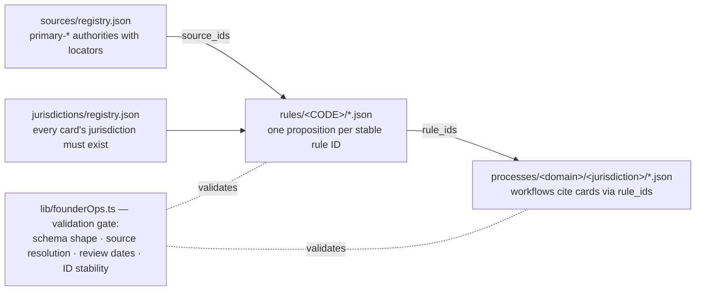

# Canonical rule cards

One proposition per stable rule ID, scoped to a jurisdiction and backed by exact source locators. Processes reference IDs so an agency or statute change can be traced to all affected workflows. A rule's `reviewed_on` and `review_due` document editorial checks; they do not establish a legal effective interval. Unknown `valid_from` and `valid_until` remain null until verified. Do not reuse an ID to change the meaning of an old rule: version it and document the affected process revisions.

## What a rule card is

One JSON file per proposition under `rules/<JURISDICTION-CODE>/` — 47 cards committed today
(33 US-FED, 6 US-DE, 3 US-CA, 2 US-NV, 2 US-TX, 1 EU, counted 2026-10-03), all status
`demonstration`. A trimmed real card
(`rules/US-FED/us-fed-1120-filing-deadline.json`):

```jsonc
{
  "id": "us-fed.1120-filing-deadline",
  "kind": "legal",
  "statement": "A domestic corporation generally must file Form 1120 by the 15th day of the 4th month after the end of its tax year…",
  "source_ids": ["irs-instructions-1120"],
  "caveat": "Short-period, dissolution, and June 30 fiscal-year rules differ, and an extension of time to file is not an extension of time to pay. …",
  "jurisdiction": "US-FED",
  "version": "0.1.0",
  "status": "demonstration",
  "reviewed_on": "2026-09-29",
  "review_due": "2026-12-29",
  "reviewer": "Lane editorial review (corpus-expansion 2026-09-29); independent domain expert review pending",
  "valid_from": null,
  "valid_until": null
}
```

## How a card is consumed

`lib/founderOps.ts` validates every card against `schemas/rule.schema.json`, requires its
`jurisdiction` to exist in `jurisdictions/registry.json`, and requires every `source_ids`
entry to resolve in `sources/registry.json` — for `kind: "legal"` cards the source must be a
`primary-*` authority (statute, regulation, agency guidance; a provider blog cannot establish
law). Workflows in `processes/<domain>/<jurisdiction>/` cite cards by ID in `rule_ids` — e.g.
`equity.us-de.83b-election` cites `us-fed.83b-filing-period` — so a statute change traces to
every affected workflow:



## What you can contribute here

- **Rule cards for a new jurisdiction** — register the jurisdiction in
  `jurisdictions/registry.json` with an honest, narrow scope, then add `rules/<CODE>/*.json`
  cards (one proposition per stable ID) citing `primary-*` sources in
  `sources/registry.json` — statute, regulation, or agency guidance; a provider blog cannot
  establish law. Never copy US rules into another jurisdiction.
- **Refresh an existing card** — re-verify against the primary source and bump
  `reviewed_on`/`review_due`; if the meaning changed, version the ID rather than editing it in
  place, and note the affected process revisions.

Gate for both: `npx vitest run __tests__/founder-ops.test.ts` (source resolution, jurisdiction
matching, ID stability).
