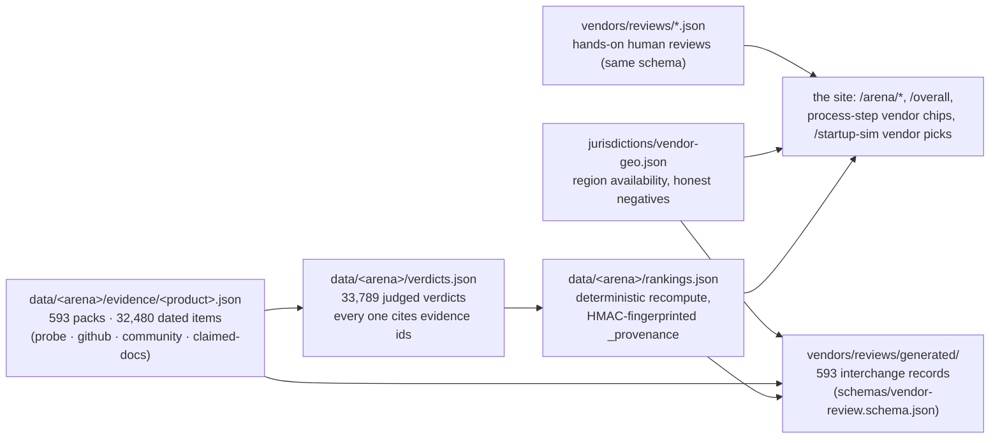

# Vendors — evidence, not an endorsement list

This repo's largest asset lives one directory over: `data/<arena>/` holds dated, reproducible,
agent tested evaluations of 590+ products across 90+ rankings — judged verdicts over a shared
story taxonomy citing vendor docs, GitHub, community sources, and hands-on probes with recorded
transcripts; rankings carry HMAC-fingerprinted `_provenance` and recompute deterministically
(`pipeline/scripts/recompute-check.ts`). Owner-affiliated products (Foreloop, AFK, Ultrametric)
are disclosed on every surface and get adversarial bias audits; favorable flips without new
evidence are reverted (`governance/REVIEW_POLICY.md`).

Live views: every ranking renders at
[ultrametric.ai/arena/&lt;arena-id&gt;](https://ultrametric.ai/arenas) (index at `/arenas`), the
cross-market rankings at [ultrametric.ai/overall](https://ultrametric.ai/overall).

## How the layer fits together

Committed counts as of 2026-10-01: 94 rankings, 593 evidence packs (32,480 dated evidence
items), 33,789 judged verdicts, 593 generated interchange records.



`reviews/` holds the interchange format for scenario-scoped vendor evaluations
(`schemas/vendor-review.schema.json`): who tested it, when, what they actually did, dated cost
basis, limitations, affiliations. A vendor's own claims can be recorded but are never test
results; an unreviewed record has no ranking. `_blank-example.json` is the template in use.

Rubric for a review: functional fit, local legal coverage (jurisdictions!), security and
privacy, API/export quality, implementation burden, support, accessibility, total cost, lock-in
and portability, failure recovery, references. Include an exit/export test. Disclose referral
payments, equity, employment, and partnerships — payment can never change scores or inclusion.

## What an interchange record is

`reviews/generated/` holds one record per judged product in this format, emitted
deterministically from the committed ranking data by
`pipeline/scripts/generate-vendor-reviews.ts` (stage 2 of the corpus lift): dated evidence URIs
from the packs, region availability from `jurisdictions/vendor-geo.json` (honest negatives
included), the committed pricing facts, the rankings dimensions, and the affiliation
disclosures — owner products always carry theirs. Regeneration is byte-identical
(`pipeline/__tests__/vendorReviews.test.ts`), so external consumers get the evidence layer in
the interchange shape without scraping the site. A trimmed real record
(`reviews/generated/accounting--bench.json`):

```jsonc
{
  "id": "accounting--bench",
  "vendor": "Bench",
  "category": "accounting",
  "status": "tested",
  "tested_use_case": "Accounting & Bookkeeping — … Judged against the ranking's evidence-graded story taxonomy: 53 user stories across 12 themes.",
  "tested_on": "2026-09-24",
  "reviewer": "Ultrametric pipeline (automated, evidence-graded)",
  "affiliations": [],
  "evidence": [
    { "kind": "probe", "uri": "https://www.bench.co/llms.txt", "observed_on": "2026-09-24" },
    { "kind": "claimed-docs", "uri": "https://www.bench.co/how-it-works", "observed_on": "2026-09-16" }
    // …3 more evidence rows trimmed
  ],
  "pricing": { "amount": null, "currency": null, "observed_on": null, "source": null, "unit": null },
  "dimensions": { "aiEra": 3.6, "agentReady": 0, "agentic": 9.3, "coverageGrade": "B" },
  "limitations": [],
  "recheck_due": "2026-12-23"
}
```

## What you can contribute here

- **A hands-on vendor review** — copy `templates/vendor-review.json` into `vendors/reviews/`,
  fill the rubric above (who tested, when, what you actually did, dated cost basis,
  limitations, an exit/export test), and disclose every affiliation. Gate:
  `npx vitest run __tests__/founder-ops.test.ts` (schema:
  `schemas/vendor-review.schema.json`).
- **Evidence for a judged product** — new doc pages, changelogs, or community sources belong
  in `data/<arena>/` via the pipeline (see the root README's Contributing section and
  CONTRIBUTING.md); the pipeline re-judges only the cells whose evidence changed.
- **Never hand-edit `reviews/generated/`** — those records are emitted deterministically from
  the committed ranking data; fix the underlying data and re-run
  `pnpm tsx pipeline/scripts/generate-vendor-reviews.ts`. Gate:
  `npx vitest run pipeline/__tests__/vendorReviews.test.ts` (byte-identical regeneration).
